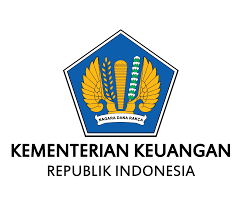

# 🎨 LOGO & FOOTER UPDATE - Official Branding

## ✅ Status: LOGO KEMENKEU DITAMBAHKAN

Semua icon diganti dengan logo resmi Kementerian Keuangan RI dan footer ditambahkan.

---

## 📝 Perubahan:

### 1. **Login Page Header**
**Before:**
```html
<i class="fas fa-chart-line text-3xl"></i>
```

**After:**
```html

```

**Visual:**
```
┌─────────────────────────────────┐
│                                 │
│      [Logo Kemenkeu 64px]      │
│                                 │
│          INVANKRI               │
│  Investasi dan Perbankan NKRI  │
│                                 │
└─────────────────────────────────┘
```

---

### 2. **App Header (Navigation)**
**Before:**
```html
<i class="fas fa-chart-line text-2xl"></i>
```

**After:**
```html

```

**Visual:**
```
┌──────────────────────────────────────────┐
│ [Logo 32px] INVANKRI          [User] [⚙️] │
│             Investasi dan Perbankan NKRI │
└──────────────────────────────────────────┘
```

---

### 3. **Footer - NEW!**
**Before:**
```html
<footer>
  <p>© 2026 INVANKRI</p>
</footer>
```

**After:**
```html
<footer>
  <p>© 2026 INVANKRI - Investasi dan Perbankan NKRI</p>
  
  <div class="border-t">
    <p>Website ini dikelola oleh</p>
    <div class="logo-box">
      [Logo Kemenkeu 48px]
      Kementerian Keuangan
      Republik Indonesia
    </div>
  </div>
</footer>
```

**Visual:**
```
┌──────────────────────────────────────────┐
│  © 2026 INVANKRI - Investasi dan        │
│  Perbankan Negara Kesatuan RI           │
│                                          │
│  ─────────────────────────────────────  │
│                                          │
│      Website ini dikelola oleh          │
│                                          │
│  ┌────────────────────────────────┐    │
│  │ [Logo]  Kementerian Keuangan   │    │
│  │         Republik Indonesia     │    │
│  └────────────────────────────────┘    │
└──────────────────────────────────────────┘
```

---

## 📁 File Structure:

```
WEB-PERBANKAN/
├── assets/
│   └── logokemenkeu.png        ← Logo Kemenkeu (NEW!)
├── index.html                  ← Updated with logo
├── main.js
└── README.md
```

---

## 🎨 Logo Specifications:

### Logo File:
- **Path:** `assets/logokemenkeu.png`
- **Format:** PNG (with transparency)
- **Usage:** Official Kementerian Keuangan RI logo

### Logo Sizes:
- **Login Page:** `h-16` (64px height)
- **App Header:** `h-8` (32px height)
- **Footer:** `h-12` (48px height)

### Logo Styling:
- **Background:** White rounded box
- **Padding:** Appropriate spacing
- **Auto width:** Maintains aspect ratio

---

## 🎯 Branding Elements:

### Official Identity:
✅ Logo Kementerian Keuangan RI
✅ Official government branding
✅ Professional appearance
✅ Credibility and trust

### Footer Information:
✅ Copyright notice
✅ Full organization name
✅ "Website ini dikelola oleh"
✅ Kemenkeu logo + name
✅ "Republik Indonesia"

---

## 📊 Visual Hierarchy:

### Login Page:
1. **Logo** (Top, centered, 64px)
2. **INVANKRI** (Large title)
3. **Tagline** (Subtitle)
4. **Login Form**

### App Header:
1. **Logo** (Left, 32px)
2. **INVANKRI** (Brand name)
3. **Tagline** (Small text)
4. **User Info** (Right)

### Footer:
1. **Copyright** (Center)
2. **Divider Line**
3. **"Website ini dikelola oleh"**
4. **Kemenkeu Logo + Name** (Prominent)

---

## 🚀 Deployment:

```
✅ Logo added to assets/
✅ All icons replaced with logo
✅ Footer updated with Kemenkeu branding
✅ Committed (c23ce35)
✅ Pushed to GitHub
⏳ GitHub Pages rebuilding... (2-5 menit)
```

**URL:**
```
https://fachrieradiyan.github.io/WEB-PERBANKAN/
```

---

## 🧪 Testing Checklist:

### Visual Verification:
- [ ] Logo muncul di login page (64px)
- [ ] Logo muncul di app header (32px)
- [ ] Logo muncul di footer (48px)
- [ ] Logo tidak pecah/blur
- [ ] Logo aspect ratio benar
- [ ] Background putih terlihat bagus

### Footer Verification:
- [ ] Copyright text muncul
- [ ] Divider line terlihat
- [ ] "Website ini dikelola oleh" text muncul
- [ ] Kemenkeu logo muncul
- [ ] "Kementerian Keuangan" text muncul
- [ ] "Republik Indonesia" text muncul
- [ ] Layout centered dan rapi

### Responsive:
- [ ] Logo responsive di mobile
- [ ] Footer responsive di mobile
- [ ] Text tidak overflow
- [ ] Layout tetap rapi

---

## 🎨 Design Notes:

### Color Scheme:
- **Footer Background:** `bg-slate-900` (Dark)
- **Text:** `text-gray-400` (Light gray)
- **Logo Box:** `bg-white` (White)
- **Logo Box Text:** `text-gray-800` (Dark)
- **Border:** `border-gray-700` (Medium gray)

### Spacing:
- **Footer Padding:** `py-8` (Vertical)
- **Section Gap:** `gap-4` (Between elements)
- **Logo Box Padding:** `px-6 py-3`
- **Border Top:** `pt-6` (After divider)

### Typography:
- **Copyright:** `text-sm` (Small)
- **"Website ini...":** `text-sm` (Small)
- **Kemenkeu Name:** `text-sm font-bold` (Small, bold)
- **"Republik Indonesia":** `text-xs` (Extra small)

---

## 📱 Responsive Behavior:

### Desktop:
```
┌────────────────────────────────────────┐
│  © 2026 INVANKRI - Full text          │
│  ──────────────────────────────────── │
│  Website ini dikelola oleh            │
│  [Logo] Kementerian Keuangan          │
│         Republik Indonesia            │
└────────────────────────────────────────┘
```

### Mobile:
```
┌──────────────────────┐
│  © 2026 INVANKRI    │
│  Full text          │
│  ──────────────────  │
│  Website ini        │
│  dikelola oleh      │
│  [Logo]             │
│  Kementerian        │
│  Keuangan           │
│  Republik Indonesia │
└──────────────────────┘
```

---

## ✅ Benefits:

### Professional:
✅ Official government logo
✅ Credible appearance
✅ Trust and authority

### Branding:
✅ Consistent visual identity
✅ Clear ownership
✅ Government affiliation

### User Experience:
✅ Clear information
✅ Professional look
✅ Easy to recognize

---

## 🎉 Summary:

✅ **Logo Kemenkeu added** to assets/
✅ **All icons replaced** with official logo
✅ **Footer enhanced** with Kemenkeu branding
✅ **3 locations updated:** Login, Header, Footer
✅ **Professional appearance** achieved
✅ **Government affiliation** clear
✅ **Committed & pushed** to GitHub

**Status:** LOGO & FOOTER UPDATED! 🎊

---

## 🔗 Quick Test:

**Production (tunggu 2-5 menit):**
```
https://fachrieradiyan.github.io/WEB-PERBANKAN/
```

**Check:**
1. Logo di login page
2. Logo di app header
3. Footer dengan Kemenkeu branding
4. Responsive di mobile

---

**Website sekarang terlihat lebih resmi dan profesional!** 🏛️
